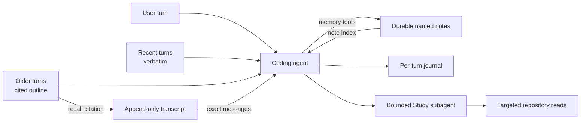
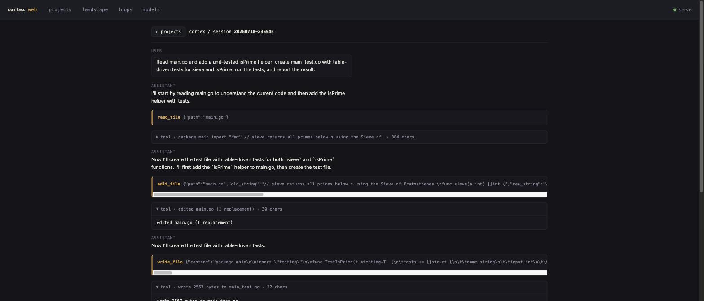

# Cortex

[](https://github.com/dereksantos/cortex/actions/workflows/test.yml)
[](go.mod)
[](LICENSE)

<p align="center">
  
</p>

**A coding agent built for long-running sessions and small models.**

Cortex is a local-first coding harness that actively manages its own working
memory. Recent work stays verbatim, older turns become a cited outline, and the
original conversation remains available on demand. Durable decisions live in
notes the agent curates itself.

The goal: let a capable small or local model keep working coherently without
repeatedly starting over—or reaching for a larger model to compensate for a
poorly managed context window.

[`Quick start`](#quick-start) · [`How memory works`](#how-working-memory-works) ·
[`Project status`](#project-status) · [`Roadmap`](ROADMAP.md)

> **Experimental:** Cortex is research-grade software used daily by its author.
> The core harness works, but configuration, compatibility, and memory policy
> are still evolving.

## See it work

A long-running session does not have to carry every old message in the model's
active context. When an earlier turn matters again, Cortex gives the agent a
route back to the exact source:

```text
you     Fix the cache invalidation bug we discussed earlier.

cortex  The relevant implementation turn is now in the session outline:
        [@session/20260710-143210#m42-58]

        I'll recall it before changing the cache behavior.

tool    recall @session/20260710-143210#m42-58

cortex  The earlier decision was to preserve the stable prompt prefix and
        invalidate only the memory-index suffix. I'll verify that invariant
        against the current code before editing it.
```

The outline is compact context, not lossy storage. The append-only transcript
remains the source of truth.

## Why Cortex?

Most coding agents eventually make a blunt trade: keep expanding the prompt,
truncate old work, summarize the whole conversation, or move to a model with a
larger window. Cortex explores a different approach: **treat the context window
as a managed cache over durable history.**

| A typical long session | Cortex |
|---|---|
| The transcript grows until it is truncated | The active working set stays bounded |
| A broad summary replaces exact history | Outline entries retain citations to exact messages |
| Old details are injected speculatively | The agent recalls relevant detail on demand |
| Durable memory is extracted automatically | The agent deliberately curates named notes |
| Large repositories are poured into context | A bounded Study subagent reads targeted spans |
| A bigger model compensates for context pressure | Context management is designed to help smaller models |

Cortex is not trying to hide all state behind embeddings. Its transcript,
journal, memory notes, and citations are inspectable files under `.cortex/`.

## Install

You need Go 1.26 and an OpenAI-compatible model endpoint. Supported
platforms are **darwin and linux**; Windows is not built or tested — CI
excludes it because the eval-harness code relies on POSIX subprocess-group
semantics (`syscall.Setpgid`, PID-group `SIGTERM`/`SIGKILL`) with no clean
Windows equivalent (see `.github/workflows/test.yml`'s matrix comment).

```bash
go install github.com/dereksantos/cortex/cmd/cortex@latest
```

Or build from source:

```bash
git clone https://github.com/dereksantos/cortex.git
cd cortex
go build -o bin/cortex ./cmd/cortex
```

Either way, confirm the binary runs:

```bash
cortex --version   # or ./bin/cortex --version
```

`cortex version` also works. The version string embeds the short git
revision it was built from; override it at build time the standard way:
`go build -ldflags "-X main.Version=1.2.3" -o bin/cortex ./cmd/cortex`.

## Quick start

### 1. Build

Already done above — see [Install](#install). The commands below assume
`./bin/cortex` (source build) or `cortex` (via `go install`) on your `PATH`.

### 2. Choose a backend

#### Local: Ollama

Pull a model and create a project-local configuration. Pin both roles because
Ollama does not expose Cortex's optional fleet-discovery metadata.

```bash
ollama pull qwen2.5-coder:7b
mkdir -p .cortex
cat > .cortex/config.json <<'JSON'
{
  "backend": {
    "endpoint": "http://localhost:11434/v1"
  },
  "models": {
    "code":  { "model": "qwen2.5-coder:7b", "window": 32768 },
    "study": { "model": "qwen2.5-coder:7b", "window": 32768 }
  }
}
JSON
```

#### Hosted: OpenRouter

Keep the key in the environment; the config stores only its variable name.

**Zero-config (curated free model).** Point the backend at OpenRouter and
leave `models` out entirely — both roles fall back to a curated `:free`
model chosen for large context and coding ability (`code` and `study` use
the same model by default):

```bash
export OPENROUTER_API_KEY='...'
mkdir -p .cortex
cat > .cortex/config.json <<'JSON'
{
  "backend": {
    "type": "openrouter",
    "endpoint": "https://openrouter.ai/api/v1",
    "key_env": "OPENROUTER_API_KEY"
  }
}
JSON
```

The curated table lives in `cmd/cortex/curated.go`. At every session start,
Cortex does one cheap, bounded (4s) check of OpenRouter's live catalog: if
the curated pick has since been retired, it substitutes the next surviving
curated model (or, failing that, discovers a `:free` model by name/context
heuristic), prints one line naming old → new and why, and journals the
event — all for that process only, never rewriting your config file.

**Pinned models.** Replace the model IDs with the models you want for
coding and Study:

```bash
export OPENROUTER_API_KEY='...'
mkdir -p .cortex
cat > .cortex/config.json <<'JSON'
{
  "backend": {
    "type": "openrouter",
    "endpoint": "https://openrouter.ai/api/v1",
    "key_env": "OPENROUTER_API_KEY"
  },
  "models": {
    "code":  { "model": "qwen/qwen3-coder", "window": 131072 },
    "study": { "model": "deepseek/deepseek-r1" }
  }
}
JSON
```

### 3. Start a session

```bash
./bin/cortex
```

On a genuine first run (no config, no prior session) `cortex` fires a
one-time greeting turn before the prompt. With a working backend configured
as above, that greeting is your first green turn — the model introduces
itself and the REPL is ready.

If you skip step 2 entirely and just run `cortex` from a real terminal with
**no** config file anywhere and no `$CORTEX_BACKEND` set, you don't need to
write a config by hand: `cortex` walks you through it — asks for an
OpenRouter API key (get one free at https://openrouter.ai/keys), stores it
in the macOS Keychain, and writes `~/.cortex/config.json` with the curated
free-model pick for you, before the greeting turn fires. Press Enter with
no key to skip; `cortex` then falls back to targeting `localhost:4000` and
reports a connection error after a few retries, same as before. This
prompt only runs on the interactive REPL (`cortex` / `cortex resume`) from
a real terminal — a piped/scripted/CI invocation with nothing configured
prints one hint line instead and behaves exactly as it did before. See
[`docs/configuration.md`](docs/configuration.md) for the full chain
(env/Keychain key reuse, local Ollama detection) and what gets written.

A useful first prompt:

```text
Study this repository, explain its architecture, and identify the smallest
high-value improvement. Don't change anything yet.
```

Sessions persist to `.cortex/sessions/<id>.jsonl` and can be resumed later:

```bash
./bin/cortex resume
```

### Let Cortex introduce itself

Yes—the README can be an input surface for Cortex. Once a backend is configured,
ask the Study subagent to turn this document into a personal onboarding guide:

```bash
./bin/cortex study README.md \
  "Explain how to start Cortex with my backend, then suggest a safe first task"
```

Or let the coding agent read the README, inspect the checkout, and guide the
next step interactively:

```bash
./bin/cortex turn \
  "Read README.md, inspect this checkout, and tell me whether I am ready to run Cortex. Do not change anything."
```

That is the practical limit of a static GitHub README—it cannot launch a local
binary itself, but it can be both the manual and the agent's grounded onboarding
source.

## How working memory works



Cortex separates three things that are often conflated:

1. **Transcript — exact session history.** Every message is persisted. Context
   demotion does not delete it.
2. **Working set — what the model sees now.** A cache-stable prefix contains the
   system prompt, cited outline, and memory index. A watermarked tail keeps
   recent turns verbatim. Whole old turns demote mechanically under pressure.
3. **Named notes — durable cross-session memory.** The model decides what is
   worth saving and uses `memory_write`, `memory_read`, `memory_search`, and
   `memory_forget` to maintain free-form notes.

`recall` bridges the working set back to the transcript. `/compact` remains a
manual summarization safety net, not the primary memory mechanism.

Read the full designs in
[`docs/context-architecture.md`](docs/context-architecture.md) and
[`docs/memory-tools.md`](docs/memory-tools.md).

## What Cortex can do

- **Navigate:** `outline`, `grep`, `read_file`, and the goal-directed `study`
  subagent find relevant code without dumping a repository into context.
- **Change:** `write_file`, `edit_file`, and workspace-confined `remove_path`
  make reviewable edits.
- **Verify:** `bash` runs builds and tests behind a command-risk gate.
- **Research:** coder-only `web_search` and SSRF-safe `fetch_url` provide
  bounded public web access.
- **Remember:** `memory_*` tools curate durable notes; `recall` recovers exact
  demoted conversation turns.
- **Curate context:** `context_*` tools let the agent evict and merge outline
  entries and tune the demotion watermarks within bounded limits.
- **Delegate:** the `agent` subagent takes on one bounded unit of
  implementation work — it reads, edits, and verifies (via `bash`) against a
  goal, then reports back what it did.

The Study subagent is intentionally narrower than the coder: it can only use
`outline`, `grep`, and targeted `read_file`. It cannot edit, run commands,
access the parent conversation, write memory, or recursively invoke Study.
The `agent` subagent is broader than Study — it can write, edit, and run
`bash` — but stays bounded: it is capped to one level of nesting, any Risky
shell command inside it is treated as Blocked (no interactive operator on
that seam), and it excludes the same session-scoped tools Study excludes
(`recall`, the memory tools, the context tools). By default it runs as the
same model the coder is currently running as (following `/model` switches);
an optional `model` argument pins a different model for one call. See
[`docs/agent-tool.md`](docs/agent-tool.md) for the design decisions and
`tools.enable_agent` in Configuration to disable it.

<details>
<summary><strong>Complete tool reference</strong></summary>

| Tool | Purpose |
|---|---|
| `read_file` | Read a file or exact line range; large targets redirect to Study or a Go declaration skeleton. |
| `write_file` | Create or overwrite a file. |
| `edit_file` | Apply exact, whitespace-tolerant, or atomic multi-edits. |
| `study` | Produce a goal-curated digest of a large file or directory. |
| `agent` | Hand off one bounded implementation task (read, edit, verify via `bash`) to a subagent; unlike `study`, it can write files and run commands. |
| `outline` | Map project/file structure without reading all contents. |
| `grep` | Return bounded `file:line:text` content matches. |
| `bash` | Run a shell command through the risk gate. |
| `remove_path` | Delete within the workspace; root, `.git`, and `.cortex` are refused. |
| `web_search` | Search the public web for ranked titles, URLs, and snippets. |
| `fetch_url` | Fetch bounded text from a public HTTP(S) URL; private/local destinations are refused. |
| `memory_write`, `memory_read` | Create/update a durable named note, or read one in full. |
| `memory_search`, `memory_forget` | Find notes by keyword, or remove an obsolete note. |
| `recall` | Fetch exact messages behind a session-outline citation; pass `budget` for a compact digest instead. |
| `context_evict` | Remove an outline entry from the active working set, not the transcript. |
| `context_merge` | Merge consecutive demoted turns deterministically. |
| `context_adjust_watermarks` | Apply bounded working-set watermark adjustments. |

</details>

## Commands

<details>
<summary><strong>CLI and REPL reference</strong></summary>

```text
cortex                            interactive REPL
cortex --version | cortex version   print the version and exit
cortex resume [id]                  resume a session; defaults to latest
cortex turn [--session id] [--json] <input...>
                                  run one headless turn
cortex study <path> [goal...]       run the read-only Study subagent
cortex change <start|commit|status> local one-change-at-a-time git lifecycle
cortex serve [--port <n>]           local HTTP/SSE adapter for the web UI (loopback, bearer-token auth)
cortex scan [--json] [--root <path>] [--register]
                                  scan configured roots and list discovered projects
cortex project <add|list|remove>    manage the project registry
cortex discord                      run the Discord adapter
cortex study-eval                   run the Study acceptance gate
cortex model [--json]                catalog code/study role bindings + what
                                  the backend serves, and suggest a config
                                  models block sized to this machine's RAM
```

`cortex serve` hosts a local web UI over your projects and sessions —
here rendering a real session (the agent reading `main.go`, adding a
helper, and writing table-driven tests):



| REPL command | Purpose |
|---|---|
| `/compact` | Summarize the conversation now as a safety net. |
| `/clear` | Start a fresh session. |
| `/sessions` | List persisted session IDs. |
| `/model [name]` | Show role bindings or switch the coding model for this session. |
| `/quit`, `/exit` | Exit; Ctrl-D also works. |

Durable memory is model-driven rather than a slash command. Ask naturally to
remember or forget something and the agent will use the `memory_*` tools.

</details>

## Configuration

Configuration layers from user defaults to project overrides:
`~/.cortex/config.json` (or `$CORTEX_HOME/config.json`) → the nearest
project `.cortex/config.json` → `CORTEX_BACKEND` (env, endpoint only).
Fields merge individually.

```json
{
  "backend": {
    "type": "openrouter",
    "endpoint": "https://openrouter.ai/api/v1",
    "key_env": "OPENROUTER_API_KEY"
  },
  "models": {
    "code":  { "model": "qwen/qwen3-coder", "window": 131072 },
    "study": { "model": "deepseek/deepseek-r1" }
  }
}
```

Two configurable roles: `code` (the agent) and `study` (Study + the
summarizer); leaving `models` out entirely on an `openrouter` backend picks
a curated free model for both. See
[`docs/configuration.md`](docs/configuration.md) for the full picture:
every `tools.*` gate, every environment variable, auth resolution, and the
zero-config default — kept there as the single source so it can't drift
across this file, `CLAUDE.md`, and itself.

## Safety and privacy

Cortex is local-first, not local-only: using a hosted model sends prompts and
selected tool results to that provider. Runtime state remains inspectable under
`.cortex/` and is excluded from git by default.

- Shell commands are classified as **Safe**, **Risky**, or **Blocked**. Risky
  commands require interactive approval and are refused in headless sessions.
- File deletion is workspace-confined; the workspace root, `.git`, and
  `.cortex` cannot be removed through `remove_path`.
- `fetch_url` accepts public HTTP(S) destinations only, rechecks redirects, and
  bounds response bodies.
- Study is read-only and independently bounded by iterations, output tokens,
  cumulative bytes read, deadlines, and no-progress detection.
- Session context demotion is recoverable: exact history stays in the local
  transcript even after it leaves the model's active working set.

See [`SECURITY.md`](SECURITY.md) for vulnerability reporting.

## Evidence, not promises

The working-memory thesis is still being evaluated. Current deterministic tests
exercise the real turn path and assert that:

- every session message is either active or recoverable by citation;
- the working set remains within its configured budget;
- demotion preserves whole tool-call/result groups;
- outline labels and citations survive folding and resume;
- ordinary turns preserve a stable prompt prefix for cache reuse;
- memory notes survive across sessions and support update and forget behavior;
- Study remains read-only and inside its tool, iteration, token, and byte bounds.

Environment-gated live evaluations additionally probe cited recall, bounded
prompt growth, memory behavior, and Study groundedness against real models.
The published design notes also record the limits: context runs are still
short, Study reliability varies by model/backend, and blind recall is harder
when no visible outline clue signals relevance.

Start with [`docs/context-architecture.md`](docs/context-architecture.md),
[`docs/memory-tools.md`](docs/memory-tools.md), and
[`docs/study-subagent.md`](docs/study-subagent.md) for methodology and results.

## Project status

**Working today**

- interactive, headless, resumable, and Discord-driven sessions;
- bounded two-zone context with exact-message recall;
- durable model-curated notes and append-only turn capture;
- coding, navigation, shell, public-web, and context-curation tools;
- separate code and Study model bindings across OpenAI-compatible backends.

**Still evolving**

- installation and release packaging;
- model/backend compatibility and reliable tool calling;
- long-horizon retention and recall evaluation;
- configuration stability and context-management policy;
- the next cognition/Think/Dream layer, if evidence justifies reviving it.

**Deliberately deferred**

- a full browser or JavaScript-rendering web tool;
- automatic restoration of the removed retrieval/rerank/distill pipeline;
- claiming broad model-quality wins before longer evaluations exist.

The former daemon, dashboard, broad `cortex` CLI, and Claude Code host
integration were removed when the project narrowed around Cortex. Their history
is preserved in [`docs/archive.md`](docs/archive.md).

## Development

```bash
go build ./cmd/cortex
go test ./...
go vet ./...
./scripts/check.sh          # formatting, vet, and golangci-lint
```

The main architectural seams are:

```text
cmd/cortex/          binary, REPL/adapters, session composition, shared loop
internal/agent/    tool-call vocabulary and loop bounds
internal/cache/    bounded two-zone session working set
internal/tools/    tool declarations, dispatch, and implementations
internal/outline/  structural project/file mapping
internal/memory/   durable model-curated note store
internal/journal/  append-only event log
pkg/llm/           Anthropic, Ollama, OpenRouter, OpenAI-compatible providers
pkg/config/        layered configuration
```

## Documentation

- [`CLAUDE.md`](CLAUDE.md) — operational guide for agents and contributors
- [`ROADMAP.md`](ROADMAP.md) — current direction and status
- [`docs/configuration.md`](docs/configuration.md) — every config field, `tools.*` gate, and env var
- [`docs/context-architecture.md`](docs/context-architecture.md) — two-zone context and citation recall
- [`docs/memory-tools.md`](docs/memory-tools.md) — model-driven durable memory
- [`docs/engine-unification.md`](docs/engine-unification.md) — shared agent-loop design and shipped tracker
- [`docs/study-subagent.md`](docs/study-subagent.md) — bounded read-only Study architecture
- [`docs/archive.md`](docs/archive.md) — the system before Cortex centered on Cortex

## License

[MIT](LICENSE)
